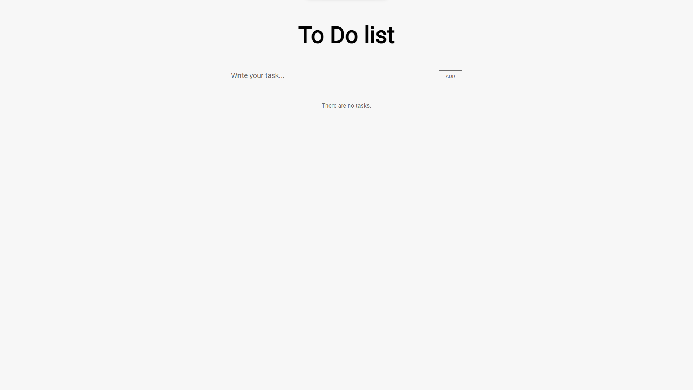

# To Do List

👋 Hi, I'm @liudasbo

📧 Contacts :

* [LinkedIn](https://www.linkedin.com/in/liudasbo/)
* [Twitter](https://twitter.com/liudasbo)

## Application Description

This is a simple "To Do List" WEB app, the application allows the user to write tasks and add them to the list then the user can edit tasks and mark them as completed or delete them.

## Objective

This is my first GitHub project. It is a small and simple project to focus on the fundamentals of using Git & GitHub. I also improved my knowledge of HTML CSS and JavaScript languages.

## Screenshots

Desktop: 
 

## Viewing the application

https://liudasbo.github.io/to-do-list/

## Project version

Currently, the project version is: 1.0.0

* 1.0.0 - First release.
